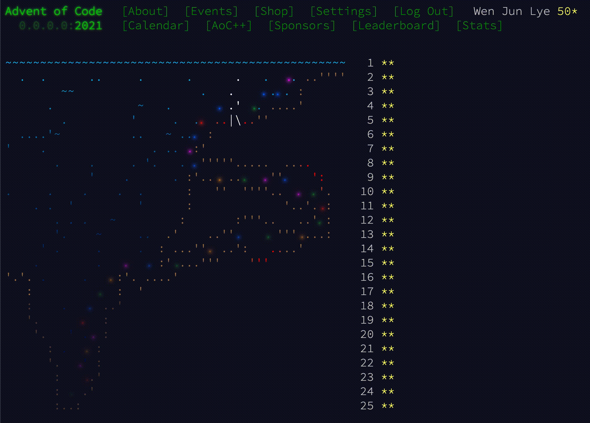
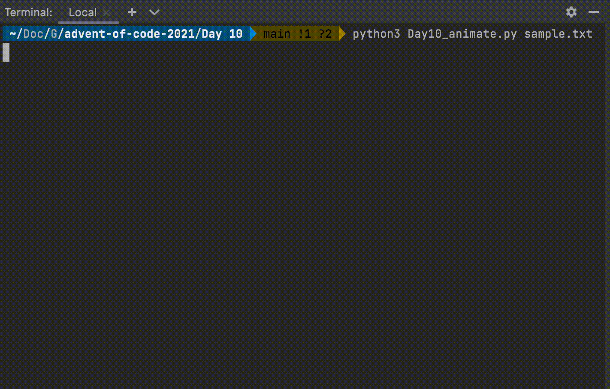
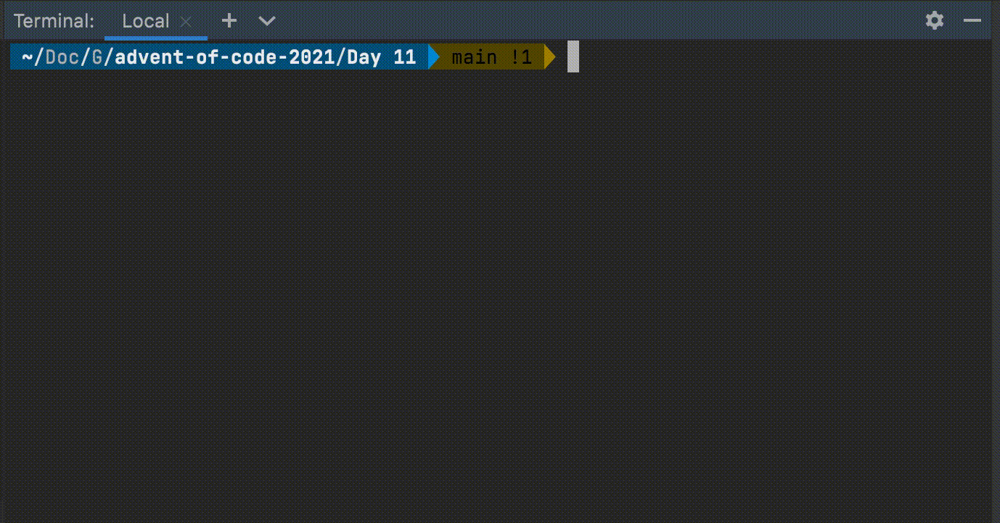
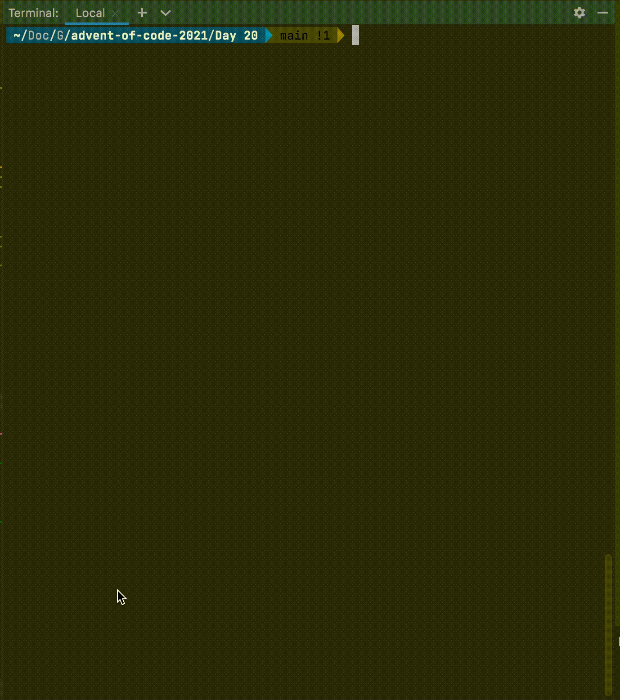
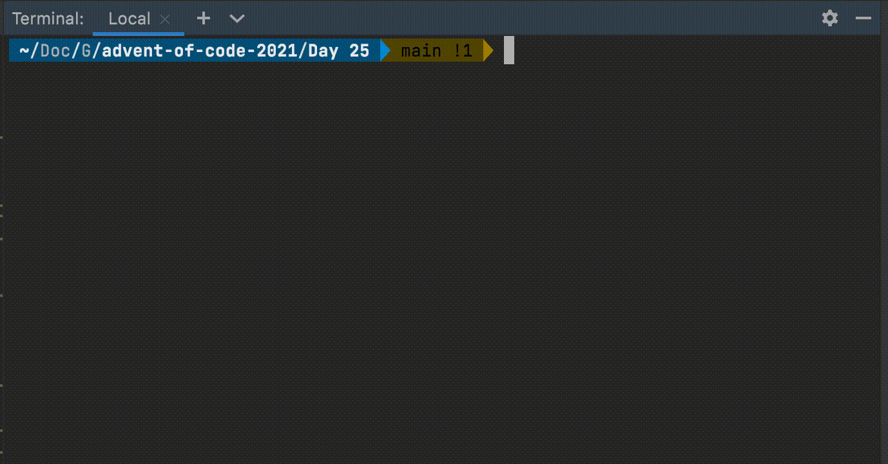

# Advent of Code 2021

Advent of Code (AoC) is a yearly coding challenge in the form of an Advent calendar. Every day from Dec 1 to 25, a small programming puzzle is released and hundreds of thousands of people attempt to solve the problems.

This repository contains my solutions to the puzzles in Advent of Code 2021, written in Python.

## Blog

- [What I learnt from Advent of Code 2021](https://dev.to/xlzior/what-i-learnt-from-advent-of-code-2021-1c6a)
- [Notable problems from Advent of Code 2021](https://dev.to/xlzior/notable-problems-from-advent-of-code-2021-2lp9)

## Noteworthy Days

### Day 16: Packet Decoder

- [Problem Statement](https://adventofcode.com/2021/day/16), [Solution](https://github.com/xlzior/advent-of-code-2021/blob/main/Day%2016/Day16_next.py)
- Applied object-oriented principles/features like inheritance and abstract classes to represent the problem appropriately

### Day 18: Snailfish

- [Problem Statement](https://adventofcode.com/2021/day/18), [Solution](https://github.com/xlzior/advent-of-code-2021/blob/main/Day%2018/Day18.py)
- Implemented a binary tree (including min, max, predecessor, successor operations) to represent special mathematical expressions as defined in the problem statement

### Day 19: Beacon Scanner

- [Problem Statement](https://adventofcode.com/2021/day/19), [Solution](https://github.com/xlzior/advent-of-code-2021/blob/main/Day%2019/Day19-1.py)
- Created classes to model the entities in the problem and relevant dunder/magic methods for more intuitive code

### Day 20: Trench Map

- [Problem Statement](https://adventofcode.com/2021/day/20), [Solution](https://github.com/xlzior/advent-of-code-2021/blob/main/Day%2020/Day20.py)
- Simulated a generalisation of Conway's game of life

### Day 22: Reactor Reboot

- [Problem Statement](https://adventofcode.com/2021/day/22), [Solution](https://github.com/xlzior/advent-of-code-2021/blob/main/Day%2022/Day22-2.py)
- Applied the Inclusion-Exclusion Principle to a CS problem
- Created the appropriate classes and methods using object-oriented principles to efficiently and concisely apply the principle

### Day 23: Amphipod

- [Problem Statement](https://adventofcode.com/2021/day/23), [Solution](https://github.com/xlzior/advent-of-code-2021/blob/main/Day%2023/Day23-2.py)
- Applied Dijkstra's algorithm to a novel context which required generating next states / edges on the fly

## Animations

After attempting the problems, I would visit the AoC subreddit to browse other people's solutions. I was inspired by the visualisations I saw and decided to try animating some of my own. These animations were done using Python and print to the command line directly.

### Day 10: Syntax Scoring

[Problem Statement](https://adventofcode.com/2021/day/10), [Animation](https://github.com/xlzior/advent-of-code-2021/blob/main/Day%2010/Day10_animate.py)

### Day 11: Dumbo Octopus

[Problem Statement](https://adventofcode.com/2021/day/11), [Animation](https://github.com/xlzior/advent-of-code-2021/blob/main/Day%2011/Day11.py)

### Day 20: Trench Map

[Problem Statement](https://adventofcode.com/2021/day/20), [Animation](https://github.com/xlzior/advent-of-code-2021/blob/main/Day%2020/Day20.py)

### Day 25: Sea Cucumber

[Problem Statement](https://adventofcode.com/2021/day/25), [Animation](https://github.com/xlzior/advent-of-code-2021/blob/main/Day%2025/Day25.py)

