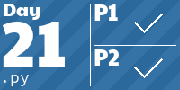

<!-- AOC TILES BEGIN -->
<h1 align="center">
  Advent of Code - 361/514 ⭐
</h1>
<h1 align="center">
  2025 - 14 ⭐ - TypeScript
</h1>

<h1 align="center">
  2024 - 50 ⭐ - Go
</h1>

<h1 align="center">
  2023 - 50 ⭐ - Scala
</h1>

<h1 align="center">
  2022 - 50 ⭐ - Python
</h1>

<h1 align="center">
  2021 - 50 ⭐ - Python
</h1>

<h1 align="center">
  2019 - 23 ⭐ - Python
</h1>

<h1 align="center">
  2018 - 33 ⭐ - Python
</h1>

<h1 align="center">
  2016 - 50 ⭐ - 
</h1>

<h1 align="center">
  2015 - 41 ⭐ - Python
</h1>

<!-- AOC TILES END -->
